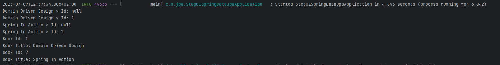
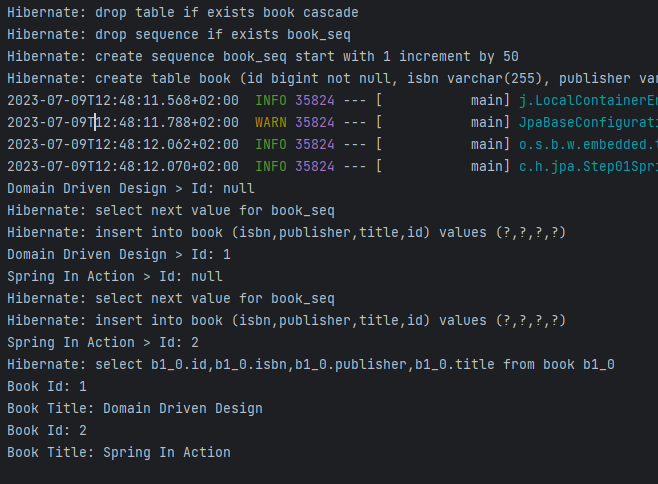
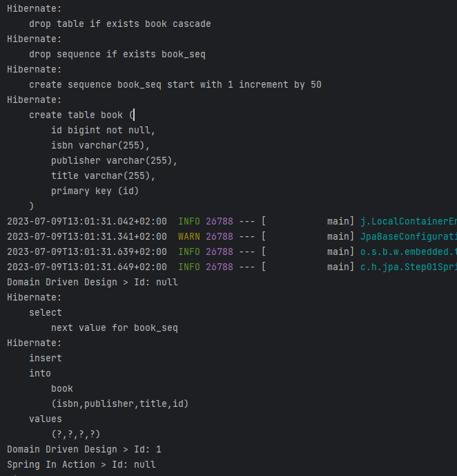
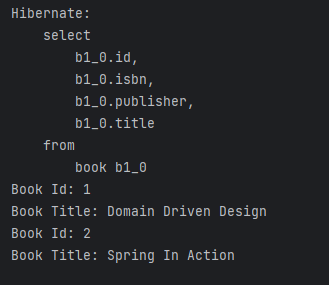
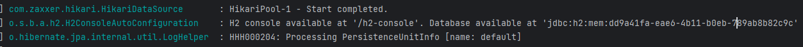

# Getting Started

### Dependencies

In dependencies we can find: 
 - spring boot starter web
     - includes tomcat and core dependencies
     - All springframework dependencies for web
 - spring boot starter jpa
     - spring jdbc 
     - hibernate core    
 - h2 embedded database 
 - lombok
 - test libs

### Configuration

To create an entity object, we need to define a basic POJO annotated as Entity and 
containing an id that match the primary key we want to set.
In all case, we also need a no args constructor

```
package com.hibernate.jpa.domain;

import jakarta.persistence.Entity;
import jakarta.persistence.Id;
import lombok.Getter;
import lombok.Setter;


@Entity
@Getter @Setter
@AllArgsConstructor @NoArgsConstructor
public class Book {
    @Id
    @GeneratedValue(strategy = GenerationType.AUTO)
    private Long id;
    private String title;
    private String isbn;
    private String publisher;

    public Book(String title, String isbn, String publisher) {
        this.title = title;
        this.isbn = isbn;
        this.publisher = publisher;
    }
}
```

#### Equality in hibernate
Not mandatory but could be recommended:

```
@Override
public boolean equals(Object o) {
    if (this == o) return true;
    if (o == null || getClass() != o.getClass()) return false;
     Book book = (Book) o;

        return Objects.equals(id, book.id);
    }
```

#### Using repositories
Looking in spring data commons package in the org.springframework.data.repository package, 
We have the repository interface that takes domain and domain type of id used for the domain (for example Long)

```
@Indexed
public interface Repository<T, ID> {
}
```

All repositories are extending this interface. For example CrudRepository has the following declaration. There are other interfaces that can be used 
such as JpaRepository, PagingAndSortingRepository...

```
package org.springframework.data.repository;

import java.util.Optional;

import org.springframework.dao.OptimisticLockingFailureException;

@NoRepositoryBean
public interface CrudRepository<T, ID> extends Repository<T, ID> {

	<S extends T> S save(S entity);
	<S extends T> Iterable<S> saveAll(Iterable<S> entities);
	Optional<T> findById(ID id);
	boolean existsById(ID id);
	Iterable<T> findAll();
	Iterable<T> findAllById(Iterable<ID> ids);
	long count();
	void deleteById(ID id);
	void delete(T entity);
	void deleteAllById(Iterable<? extends ID> ids);
	void deleteAll(Iterable<? extends T> entities);
	void deleteAll();
}
```

We can note NoRepositoryBean annotation on top of the interface definition.
Annotation to exclude repository interfaces from being picked up and thus in consequence getting an instance being
created.
This will typically be used when providing an extended base interface for all repositories in combination with a
custom repository base class to implement methods declared in that intermediate interface. In this case you typically
derive your concrete repository interfaces from the intermediate one but don't want to create a Spring bean for the
intermediate interface.

To create a simple repository interface that will provide JpaRepository methods implemented : 
```
package com.hibernate.jpa.repository;

import com.hibernate.jpa.domain.Book;
import org.springframework.data.jpa.repository.JpaRepository;
import org.springframework.stereotype.Repository;

@Repository
public interface BookRepository extends JpaRepository<Book, Long> {
}
```

#### Setup data at startup
the easiest way is to create a class that implements CommandLineRunner.
The component class will have his method run triggered at start up and execute the JPA methods

```
package com.hibernate.jpa.bootstrap;

import com.hibernate.jpa.domain.Book;
import com.hibernate.jpa.repository.BookRepository;
import org.springframework.beans.factory.annotation.Autowired;
import org.springframework.boot.CommandLineRunner;
import org.springframework.stereotype.Component;

@Component
public class DataInitializer implements CommandLineRunner {
private final BookRepository bookRepository;

    @Autowired
    public DataInitializer(BookRepository bookRepository) {
        this.bookRepository = bookRepository;
    }

    @Override
    public void run(String... args) {
        /// save
        Book bookDDD = new Book("Domain Driven Design", "123", "RandomHouse");
        System.out.println("Domain Driven Design > Id: " + bookDDD.getId() );
        Book savedDDD = bookRepository.save(bookDDD);
        System.out.println("Domain Driven Design > Id: " + savedDDD.getId() );

        Book bookSIA = new Book("Spring In Action", "234234", "Oriely");
        System.out.println("Spring In Action > Id: " + bookSIA.getId() );
        Book savedSIA = bookRepository.save(bookSIA);
        System.out.println("Spring In Action > Id: " + savedSIA.getId() );

        // find all
        bookRepository.findAll().forEach(book -> {
            System.out.println("Book Id: " + book.getId());
            System.out.println("Book Title: " + book.getTitle());
        });

    }
}
```

As a result : 
> 2 objects were inserted onto database
> 2 objects were retrieved from database 




#### logging data in console

We can also have more details on what is happening. We can show sql operations by adding the following property in
application.properties 

> spring.jpa.show-sql=true



We can also use a better implementation:

> spring.jpa.properties.hibernate.show_sql=true
> spring.jpa.properties.hibernate.format_sql=true

We obtain the following result: 



For select :




#### Access to console



