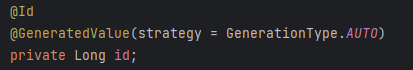

# Getting Started

### Numeric primary keys

we can use numeric values as pk
>GenerationType.AUTO: let hibernate pick, best practice is to specify (not the best choice)
>GenerationType.SEQUENCE: use database sequence (not a mysql feature, more an Oracle db feature)
>GenerationType.IDENTITY: use auto incremented database column
>GenerationType.TABLE: use database table to simulate sequence (this is what was used by auto ..., least scalable of the options)

### UUID Primary keys
* UUID : universally Unique Identifier (128 bit value)
  * commonly used as primary key, can help index performance
  * downside: uses more disk space
* IETF RFC 4122: an international standard for UUID generation
  * hibernate implements by default a custom generator
  * hibernate can be configured to generate a IETF RFC 4122 compliant UUID

### Natural primary keys
* a unique value with business meaning outside of the database
  * a upc or isbn could be considered as natural key, since both are expected to be unique
  * common on old legacy databases
  * not considered as best practice
* Composite primary keys
  * two values with business meaning combined to make a unique value
  * not considered as best practice
  * also common on legacy databases

### Which to use ? 
* small tables: ie. few million rows -> favor numbers (integer or long)
* large tables: ie. 10's of millions, billions -> favor UUID (if disk space allows)
* generally avoid using natural or composite keys
* fine in edge cases, like a small code lookup table

### What will be tested
* auto increment: already showing table, sequence not supported in mysql
* UUID
* UUID RFC 4122
* natural key
* composite

