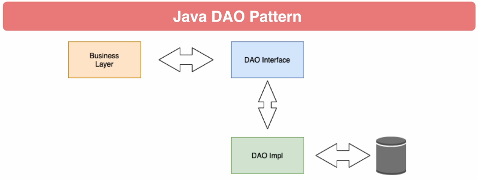

# Getting Started

### DAO pattern

* DAO: data access object
* pattern was precursor to JPA, before ORMs became popular
* Older and uses JDBC for data access
* Common to see in legacy J2EE applications
* While not common to use anymore, it's a good way to use JDBC
* Very similar to the repository pattern used by Spring Data

### Java Patterns
* DAO Pattern purpose is to isolate persistence operations from application layer
* for example: when application needs to persist an object it should not need to understand the underlying persistence technology
* Domain class: simple POJO, same as entities. Domain classes won't use JPA Annotations
* DAO Api provide interface for crud operations
* DAO implementation implements persistence functionality

### Spring boot jdbc
* database connection: typically with JDBC, you need to create and manage the database connection
* spring boot auto configure database connection
* database connection components are available as spring beans in the spring context

### What's next
* JDBC DAO create a DAO layer using JDBC only (covered)
* JDBC Template spring uses a helper abstraction over JDBC (covered)
* JDBC Template DAO  (not covered now)

