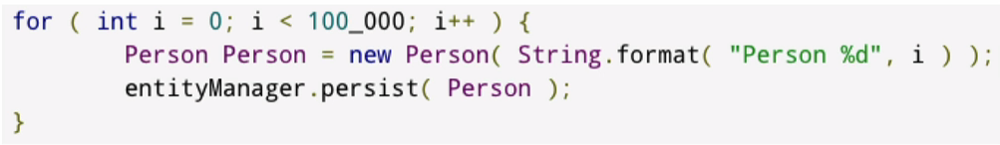

# Hibernate DAO & Queries
### About hibernate
* Hibernate is a very popular and mature ORM solution for java
* ORM : Object Relational Mapping
* Hibernate also implements the java JPA Specification
* A lot of the API specification was actually based on Hibernate
* Coding to the Java specification will keep code independant of Hibernate
* Hibernate also has a native API
* Coding to this API make code dependent on hibernate

### Terminology
* Session factory: expensive to create, your application should only have one instance
* Entity manager factory: JPA equivalent of session factory
* Session: single threaded, short lived object, cheap to create. Session wrap JDBC Connection
* Entity manager: JPA equivalent of session
* Transaction: single threaded, short lived object to define transaction boundaries
* Entity transactions: JPA equivalent of transaction

### Persistence context
* Session / entity manager: create a context for dealing with persistent data
* transient: the entity has just been instantiated and is not associated with a persistent context.
  It has no persistent representation in the database and typically no identitier value has
  been assigned (unless the assigned generator was used)
* Managed or persistent: the entity has an associated identifier and is associated with a persistence context. It may or may not exist physically in database yet
* Detached: the entity has an associated identifier but is no longer associated with a persistence context (usually because the persistence context was closed or the instance was evicted from the context
* Removed: the  entity has an associated identifier and is associated with the persistence context, however, it is scheduled for removal from the database

### Detached entities
Detached entities are common errors: 
* common root cause is working outside the session scope or a closed session
* spring data jpa by default, will an implicit transaction
  * meaning you can see this error when accessing entity properties outside of a transaction

### Caching
* persistence context / first level cache: by default hibernate will cache entities in persistence context
  * change outside the context may not be seen
  * very efficient for doing work with the context of a session
* second level cache: disabled by default, JVM or cluster level cache
  * recommended to enable on a per entity basis
  * broad support for popular options such as jCache, Ehcache and infinispan

### Caching issues

* here hibernate would add 100.000 objects to session level, possible out of memory
* long running transaction could deplete transaction pool
* JDBC Batching not enabled by default, each insert is a round trip to the DB
* flush() and clear() methods can be used to clear session cache