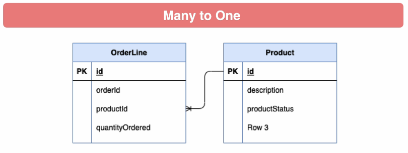
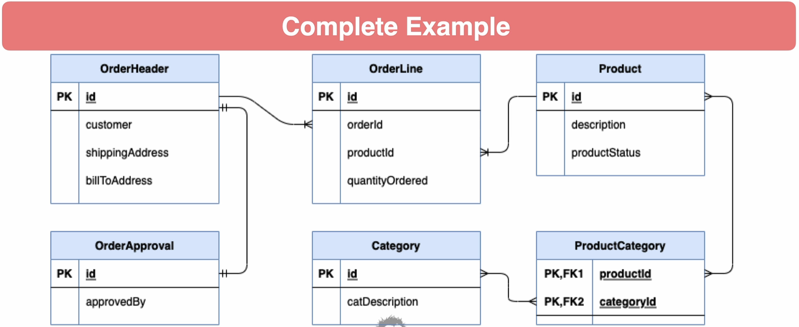

# Hibernate & spring data jpa

### Inheritance

* Inheritance is a fundamental concept of Object Oriented Programming
  * A class can inherit properties and behaviors from other classes
* The relational model does not exactly support inheritance
* In a JPA context with inheritance, you are concerned with the persistence of properties

### JPA Inheritance
* Mapped Super Class - Top level entities inherit properties and have one table per top level
entity
* Single Table - Object hierarchy is mapped to a single table. 
  * Default when using @Inheritance mapping annotation
* Joined Table - Base Classes and subclasses have their own table, fetching subclass requires a join
* Table Per Class - Each object is mapped to a table, joins are used to create top level entities

### Mapper super class

### Single table

### Joined table

### Table per class

### JPA Inheritance downsides

* Leakage - A term to describe when the concepts of one paradigm ‘leak’ into another
* The Primary Key / Id property is an example of the relational model ‘leaking’ into the object
model
* Mapped Superclass - Does not allow for polymorphic queries
* Single Table - Requires discriminator column and columns for all properties of child classes
* Joined Table - Requires SQL Joins and object id in child object tables
* Table Per Class - Requires complex union joins to support polymorphic queries

### Which to use

* Leakage is unavoidable
* Single Table, Joined Table, and Table Per Class ‘Leak’ into the relational model and can be complex
for non-Hibernate clients
* K.I.S.S. - Keep It Simple Stupid
* Mapped Superclass is the simplest and addresses probably 85% of use cases
* Be aware of the other options, and use when you feel its appropriate