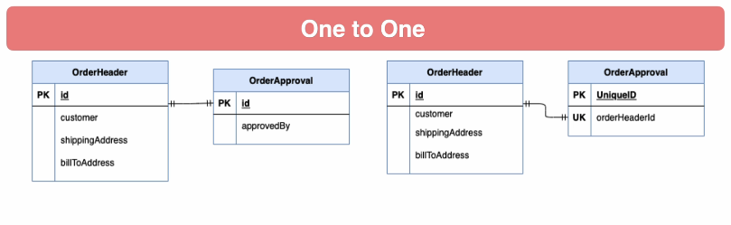
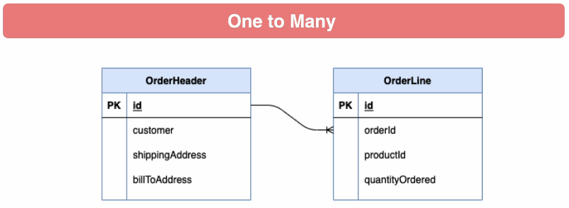
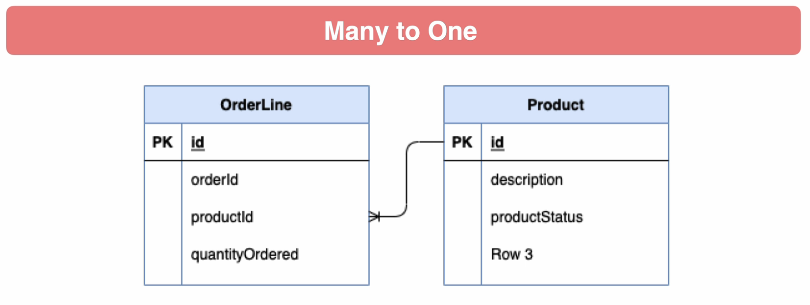
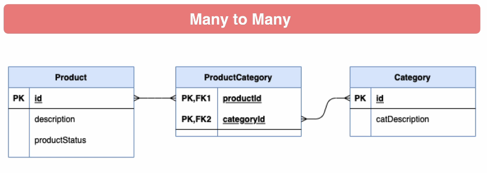
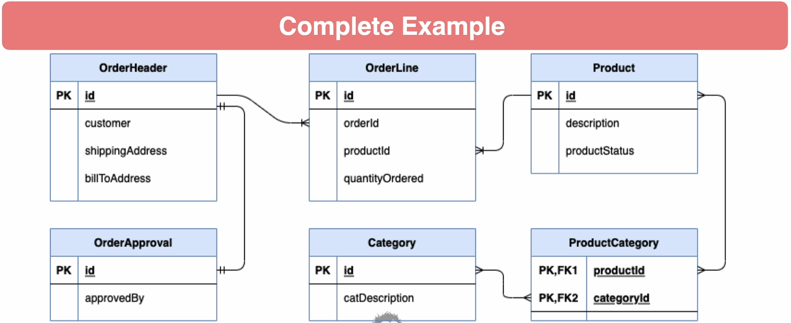

# Hibernate & database relationship

### Database Relationships
* One to One - Both tables have only one record on each side of the relationship
* One to Many / Many to One - The primary table has one record that relates to zero or many records in
  the related table
* Many to Many - Each record in both tables may be related to zero or many records in the
  related table

### Database Constraints
* Best practice is to use database constraints to enforce relationships
* One to One - Both tables can share the primary key value, or one table can have its own
  primary key and unique key on id column of related table
* One to Many / Many to One - The related table has column for primary key of primary table, with foreign
  key constraint
* Many to Many - Join table is used with composite primary key consisting of the primary
  key values of related tables, with foreign key constraints

### One to one
Not commonly used.
2 way to implement: 
* the primary key is the same on both tables
* one table holds the foreign key that references the second table

### One to Many 
OrderHeader can have multiple OrderLine
On the other hand OrderLine belong to one OrderHeader
The foreign key constraint is hold by OrderLine. 

### Many to One
OrderLine have a productId

### Many to Many
A product belong to many product category and a product category has several products. 
Here a pivot table is used and hold both foreign keys that refer to each primary keys.

### Complete example

### Relationship Direction
* Bi-Directional - Relationship can be accessed from either side of the relationship
  * Example OrderHeader and OrderLine - likely needed from either side
* Uni-Directional - Relationship can be access from either side of the relationship
  * Example OrderLine and Product - unlikely you will need to access Order Lines from
      Product
  * The Product entity does not have a reference to OrderLine

### Cascade operations
* Hibernate has the ability to Cascade persistence operations
* Example - A delete of just Order Header would fail on foreign key constraints to OrderLine
and OrderApproval
* Explicitly, you would need to perform deletes of the child records first
* Optionally, Hibernate can be configured to delete OrderLines and OrderApproval before
deleting the OrderHeader
* Use with caution - you would not wish to delete Product records on delete for OrderLine

### Foreign Key Declaration
* JPA does have a @ForeignKey annotation
* This is meta-data information only.
* Hibernate will reference this for schema generation only
* It is not enforced nor generated if missing
* When using schema migration tools like Liquibase or Flyway it is not needed

### Flushing

Flushing is the process of synchronizing the state of the persistence context with the underlying database. The EntityManager and the Hibernate Session expose a set of methods, through which the application developer can change the persistent state of an entity.

The persistence context acts as a transactional write-behind cache, queuing any entity state change. Like any write-behind cache, changes are first applied in-memory and synchronized with the database during flush time. The flush operation takes every entity state change and translates it to an INSERT, UPDATE or DELETE statement.

The flushing strategy is given by the flushMode of the current running Hibernate Session. Although JPA defines only two flushing strategies (AUTO and COMMIT), Hibernate has a much broader spectrum of flush types:

* ALWAYS: Flushes the Session before every query;
* AUTO: This is the default mode and it flushes the Session only if necessary;
* COMMIT: The Session tries to delay the flush until the current Transaction is committed, although it might flush prematurely too;
* MANUAL: The Session flushing is delegated to the application, which must call Session.flush() explicitly in order to apply the persistence context changes.
By default, Hibernate uses the AUTO flush mode which triggers a flush in the following circumstances:

* prior to committing a Transaction;
* prior to executing a JPQL/HQL query that overlaps with the queued entity actions;
* before executing any native SQL query that has no registered synchronization.

### JPA Specific Cascade Types

* ALL - propagates all operations
* PERSIST - Will also save child objects (transient instances)
* MERGE - Merge copies the state of a given object to the persistent object. MERGE
includes child entities
* REMOVE - Cascades delete operations to child objects
* REFRESH - Cascades refresh operations to child objects
* DETACH - Detaches child objects from persistence context

### Hibernate Specific Cascade Types
* DELETE - Same as JPA REMOVE
* SAVE_UPDATE - Cascades Hibernate Save and Update operations to child objects
* REPLICATE - Replicates child objects to second data source
* LOCK - Reattaches entity and children to persistence context without refresh