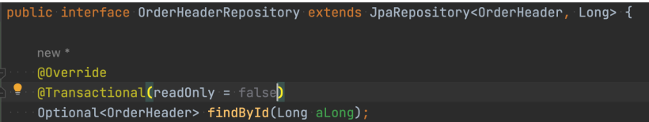
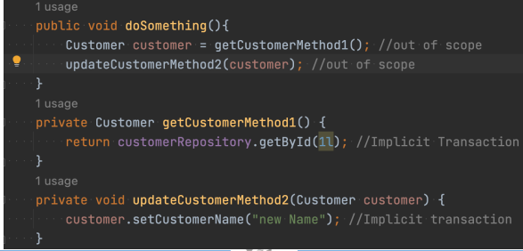
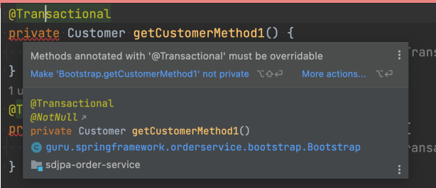
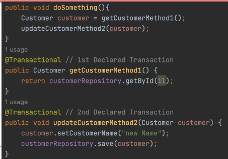
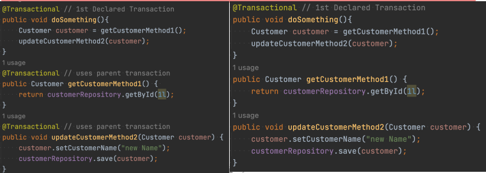
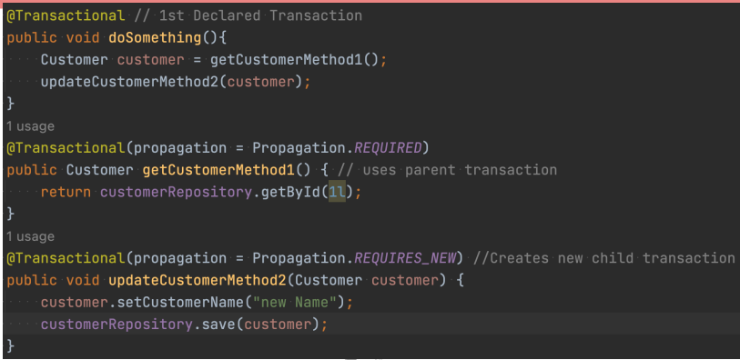

# Hibernate & Spring Data JPA: Databases transactions

### SQL Database Transactions - ACID
* Atomicity - All operations are completed successfully or database is returned to previous
state.
* Consistency - Operations do not violate system integrity constraints.
* Isolated - Results are independent of concurrent transactions.
* Durable - Results are made persistent in case of system failure (ie written to disk)

### important terms

* Transaction - A unit of work. One or more SQL operations
    * Typically DML (and Not DDL) statements which alter data.
    * Can be just one; can be hundreds or thousands.
* Commit - Indicates the end of the transaction and tells database to make changes permanent.
    * More efficient to do multiple operations in a transaction. There is a ‘cost’ with commits.
* Rollback - Revert all changes of the transaction
* Save Point - Programmatic point you can set, which allows you to rollback to (ie rollback part of a transaction)

### database locks

* The database will lock the records, (in some cases whole table or database) to prevent
other processes from changing data
    * ACID compliance
* Within a transaction the following DML statements will lock records of the affected rows:
  * SELECT FOR UPDATE; UPDATE; DELETE
* During the transactions other sessions attempting to modify locked records will by default
  wait for the lock to be released. (ie interactively it will seem like things are hanging)
* Deadlock - Occurs where two transactions lock each other and can never complete.
* Both fail and roll back

### Transaction Isolation Levels 
* Repeatable Read - Default Isolation Level. Your statement receives a consistent view of
the database, even if other transactions are committed during your transaction.
    * Your transaction gets a snapshot of the data, which does not change.
* Read Committed - Reads within your transaction will receive a fresh snapshot of the data.
  * Read Uncommitted - Reads are not consistent, but may avoid additional database locks.
  * aka - “Dirty Read”
* Serializable - Similar to Repeatable Read, but may lock rows selected in transaction.

### Pragmatic Concepts to Remember

* Using the default transaction isolation level, your transaction see’s a snapshot of the
database as it is at the start of the transaction.
  * Changes made in other sessions and committed WILL NOT be visible
  * Changes made by your session WILL NOT be visible to other sessions until commit
* Most modern RDBMS do a good job of ACID compliance
  * Support for ACID with NoSQL database varies widely by vendor
  * ACID compliance is complex and costly - hence high performance of NoSQL databases

### The “Lost” Update
* Database record has quantity of 10
* Session A reads 10, adds 5 making quantity 15, database record is Locked during update
* Session B reads 10, adds 5 making quantity 15, but is blocked by the lock of Session A
  * Would be 20, if Session B could see the uncommitted change
* Session A commits record, releasing lock. Database record is updated to 15
* Session B released, updates database record to 15
* Thus the update of Session A is “Lost”

### JDBC Locking Modes
* JDBC Drivers support several different locking modes
* Mode applies to lifespan of the connection
* Configuration is very vendor dependent
* Rarely used in practice.
* JPA/Hibernate is generally favored

### JPA locking
* Pessimistic Locking
  * Database mechanisms are used to lock records for updates
  * Capabilities vary widely depending on database and version of JDBC driver used
  * Simplest version is “SELECT FOR UPDATE…” - Locks row or rows until commit or
  rollback is issued
* Optimistic Locking
  * Done by checking a version attribute of the entity

### JPA Locking - Which to Use???

* Do You Need Locking?
  * Will your application have concurrent updates of the same records???
* Pessimistic Locking
  * Use if the data is frequently updated, and if updated concurrently
  * Remember, there is a cost to performing the locking
* Optimistic Locking
  * Use if the data is read more often than updated
  * Majority of applications will use Optimistic Locking

### Multi-Request Conversations

* Multi-Request Conversation - Occurs in web form applications, or possibly RESTful too,
where the update logic is over one or more requests, thus leaving a larger window of time.
  * Pessimistic Locking is very fast, milliseconds. Will only protect against conflicts at write
  time.
  * Optimistic Locking provides a mechanism to detect stale data over a longer period of
  time (ie - multiple requests)

### JPA Pessimistic Locking
* Pessimistic Lock Modes
  * PESSIMISTIC_READ - uses shared lock, prevents data from being updated or deleted
  * PESSIMISTIC_WRITE - uses exclusive lock, prevents data from being read (in some
  isolation levels), updated or deleted
  * PESSIMISTIC_FORCE_INCREMENT - uses exclusive lock, increments version property
  of entity
* Most databases will support PESSIMISTIC_WRITE, this is the option you will typically use
  * Use PESSIMISTIC_FORCE_INCREMENT if entity has version property

### JPA Optimistic Locking
* Uses a version property, which is incremented with each update
* Can be int, Integer, long, Long, short, Short, or java.sql.Timestamp
  * Most common to use is Integer
* Prior to an update, Hibernate will read the corresponding database record. If the version
  does not match, an exception is thrown
* Downsides:
  * Updates outside of JPA/Hibernate which do not update the version property will break this
  * Performance - read before each update

### JPA Optimistic Lock Modes
* OPTIMISTIC - Obtains optimistic read lock for all entities with version attribute
* OPTIMISTIC_FORCE_INCREMENT - Same at OPTIMISTIC, but in increments the version
value
* READ - JPA 1.x, same as OPTIMISTIC
* WRITE - JPA 1.x, same as OPTIMISTIC_FORCE_INCREMENT

  ### Spring Data JPA Transactions

* Spring Data JPA by default supports implicit transactions. Meaning repository methods will
create a transaction by default, if there is not an active transaction.
* Spring Data JPA has two types of implicit transactions:
  * Read operations are done in a read only context
  * Updates and deletes are done with the default transactional context
* Use read only with caution, dirty checks are skipped, making more performant
  * If object from read only context is updated and saved, you may encounter issues

### Spring Boot Testing Transactions

* Spring Boot by default will create a transaction for your tests and roll it back
* The Spring Data JPA Implicit transactions are NOT used in the test context
  * Implicit transactions are only used outside of a transactional context
* If you have a method under test with one or more repository method calls, you may see
  different results when run outside of the test context
* Typically a detached entity error from accessing lazy load properties outside the
  Hibernate context

### Declared with the @Transactional Annotation

* Spring Framework provides an @Transactional annotation in the package
“org.springframework.transaction.annotation”
* JEE also provides a @Transactional annotation in the package “javax.transaction”
* Spring will support either option
  * Spring 4.x might have some compatibility issues
* Recommended to use Spring Framework’s version of @Transactional
  * More versatile and Spring specific than JEE’s @Transactional

### Spring’s @Transactional Annotation
Transactional Annotation Attributes:
* value / transactionManager - the name of the Transaction Manager to use
* label - String to describe a transaction
* Propagation - The Transaction Propagation Type
* Isolation - Transaction Isolation Level
* timeout - Timeout for Transaction to complete
* readOnly - is read only?
* rollbackFor / rollbackforClassName - Exceptions to rollback for 
* NoRollbackFor / noRollbackforClassName - Exceptions to NOT rollback for

# @Transactional - Transaction Manager
* Spring Boot will auto-configure an instance of a Transaction Manager depending on your
dependencies
* Spring Framework provides an interface called PlatformTransactionManager
  * Implementations available for JDBC, JTA (JEE), Hibernate, etc
  * Spring Boot auto-configures the appropriate implementation
* Auto-Configured instance named ‘transactionManager

### @Transactional - Transaction Propagation
* REQUIRED - (Default) - use existing, or create new transaction
* SUPPORTS - Use existing, or execute non-transactionally if none exists
* MANDATORY - Support current, throw exception in none exists
* REQUIRES_NEW - Create new, suspend current
* NOT_SUPPORTED - Execute non-transactionally, suspend current transaction if exists
* NEVER - Execute non-transactionally, throw exception if transaction exists
* NESTED - Use nested transaction if transaction exists, create if not
* DEFAULT - (Default) Use level of JDBC connection
* READ_UNCOMMITTED - Allows for dirty, no-repeatable reads
* READ_COMMITTED - Prevent dirty reads, prevents from reading rows with uncommitted
  changes
* REPEATABLE_READ - Prevent dirty reads and non-repeatable reads
* SERIALIZABLE - prevent all dirty reads, similar to REPEATABLE_READ, and performs
  second read to verify

### @Transactional - Transaction Timeout
* Default value is -1, which is to use the underlying implementation
* Spring Boot does not override this
* Unless set specifically at the connection level, defaults to the platform setting
* For MySQL this is 8 hours

#### @Transactional - Read Only

* By default the readOnly property is set to false
* Spring Data JPA for implicate transactions of read methods will set this to true
* Using the readOnly property to true does allow for Hibernate to make some efficiency
optimizations
* This is NOT guaranteed
* DO NOT USE if you expect to update and save entities fetched 

#### @Transactional - RollbackFor / NoRollbackFor

* By default unhandled runtime exceptions will be rollback
* Typically default is fine for most situations
* Can be useful where you wish to rollback a child transaction, but not the whole transaction

#### Using @Transactional at Repository Level
* Spring Data JPA Repository methods can be overridden and customized at the repository
level

#### Implicit Transactions

Don’t Use Private Methods

#### Declared Transactions & Scope

#### Inherit transactions

#### Child transactgions

